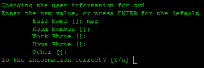

Penulis: [0xraia](https://x.com/0xraia)

## GUI Remote Desktop Server
> [!NOTE]
> Script for deploying a GUI remote desktop server with chrome remote desktop on Linux machine server.

# Tutorial

### Move to root directory
```
su root
```

### Download and run the script
```
wget https://raw.githubusercontent.com/ZuperHunt/gui-remote-server/main/script.sh && chmod +x script.sh && ./script.sh
```

### Fill with your password (SAVE IT)


### Fill with your information, input Y and press enter to continue


### Fill in the password you previously filled in (and will same for the next step)


### Go to https://remotedesktop.google.com/headless, press begin -> next -> authorize -> copy the command in the debian linux section and paste it in the terminal


### Fill in the password you previously filled in


### Go back to https://remotedesktop.google.com/ and you will see your server, press the server -> fill in the password you previously filled in -> press continue, and voila you have a GUI remote desktop server


## Help

Join komunitas [Discord ZuperHunt](https://t.co/zuperhunt) jika kamu ada pertanyaan.

## Change Logs

* 0.0.1
    * Initial Release

## Acknowledgments

Referensi
* [Gitpod-based “Virtual Private Server” Guidebook](https://luthfi0x.notion.site/Gitpod-based-Virtual-Private-Server-Guidebook-a82c45e276ea436986959e83d26b32f8)
* [Setup Chrome Remote Desktop for Digital Ocean $5 Droplet](https://medium.com/@shiba.komino/setup-chrome-remote-desktop-for-digital-ocean-5-droplet-5a02bc3a2f55)
